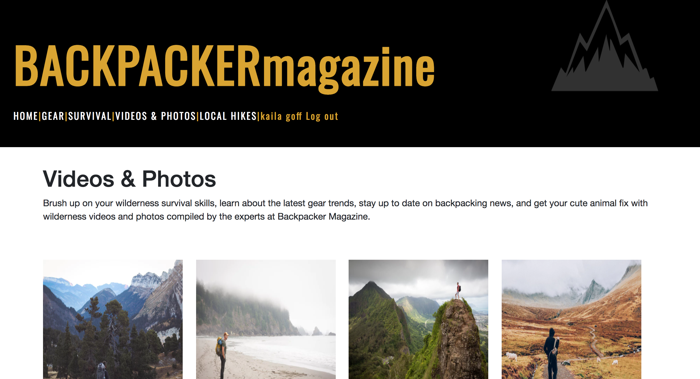

# BackpackerClone

#### _By Kaila Goff_

## Description

_An attempt to recreate the Backpacker Magazine website using Angular._

<kbd></kbd>

This project was generated with [Angular CLI](https://github.com/angular/angular-cli) version 1.6.5.

##  Current Features
  * Firebase database
  * User Authentication
  * Routing for all current pages

### Under-Development Features(currently working on)
  * Google API
  * Instagram API
  * Dynamic Routing

## Components
  * Gear | Hike | Images | Media | Skills | Stories | Survival | Trips

#### Development server

Run `ng serve` for a dev server. Navigate to `http://localhost:4200/`. The app will automatically reload if you change any of the source files.

#### Code scaffolding

Run `ng generate component component-name` to generate a new component. You can also use `ng generate directive|pipe|service|class|guard|interface|enum|module`.

#### Build

Run `ng build` to build the project. The build artifacts will be stored in the `dist/` directory. Use the `-prod` flag for a production build.

#### Running unit tests

Run `ng test` to execute the unit tests via [Karma](https://karma-runner.github.io).

#### Running end-to-end tests

Run `ng e2e` to execute the end-to-end tests via [Protractor](http://www.protractortest.org/).

#### Further help

To get more help on the Angular CLI use `ng help` or go check out the [Angular CLI README](https://github.com/angular/angular-cli/blob/master/README.md).

## Known Bugs

  * _No known bugs at this time._

## Support and contact details

  _To suggest changes, submit a pull request in the GitHub repository._

## Technologies Used

  * HTML
  * JavaScript
  * NPM
  * Angular
  * Firebase

### License

  *MIT License*

Copyright (c) 2018 **Kaila Goff**
